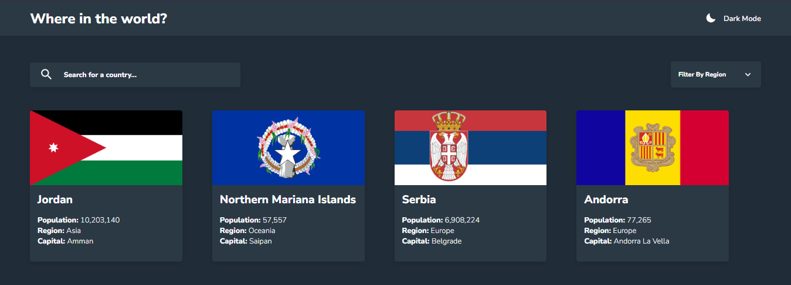
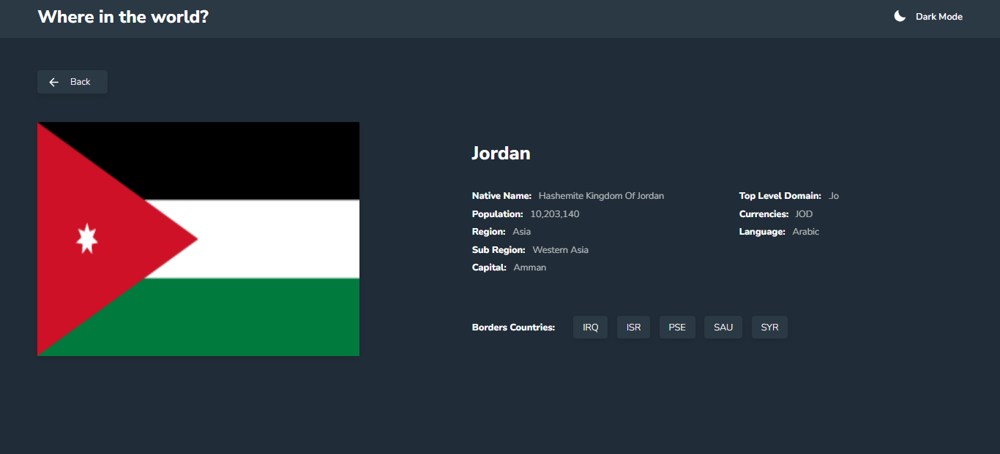

# REST Countries API with color theme switcher

In this challenge, I will be creating a Rest Counties API using [React](https://reactjs.org)

## Screenshot





## The challenge

Your users should be able to:

- See all countries from the API on the homepage
- Search for a country using an `input` field
- Filter countries by region
- Click on a country to see more detailed information on a separate page
- Toggle the color scheme between light and dark mode *(optional)*

### Built with

- [React](https://reactjs.org)
- [styled-components](https://styled-components.com/) 
- [axios](https://axios-http.com/docs/intro) - JS library
- api [REST Countries API](https://restcountries.com) - API

### Useful resources to work on this project

- [axios](https://axios-http.com/docs/intro) - This helped me to make the request to the API.

- [REST Countries API](https://restcountries.com) - This helped me to get the countries details

#### install axios
```bash
npm install axios
```

#### install styled-components

````bash
npm install styled-components
````

